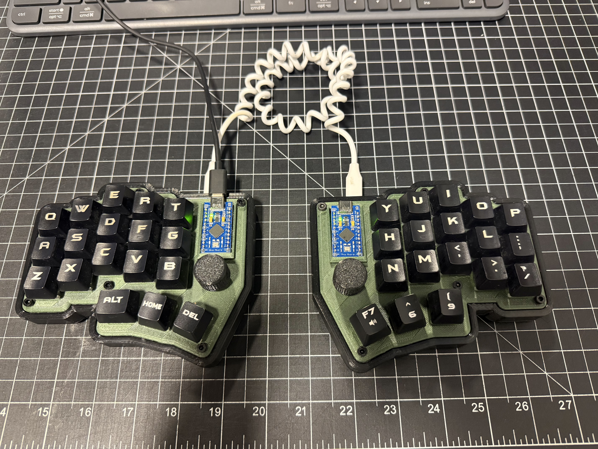
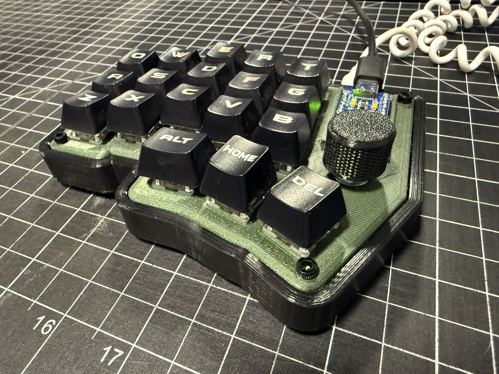
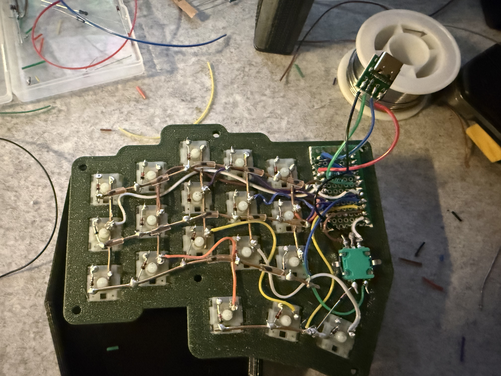
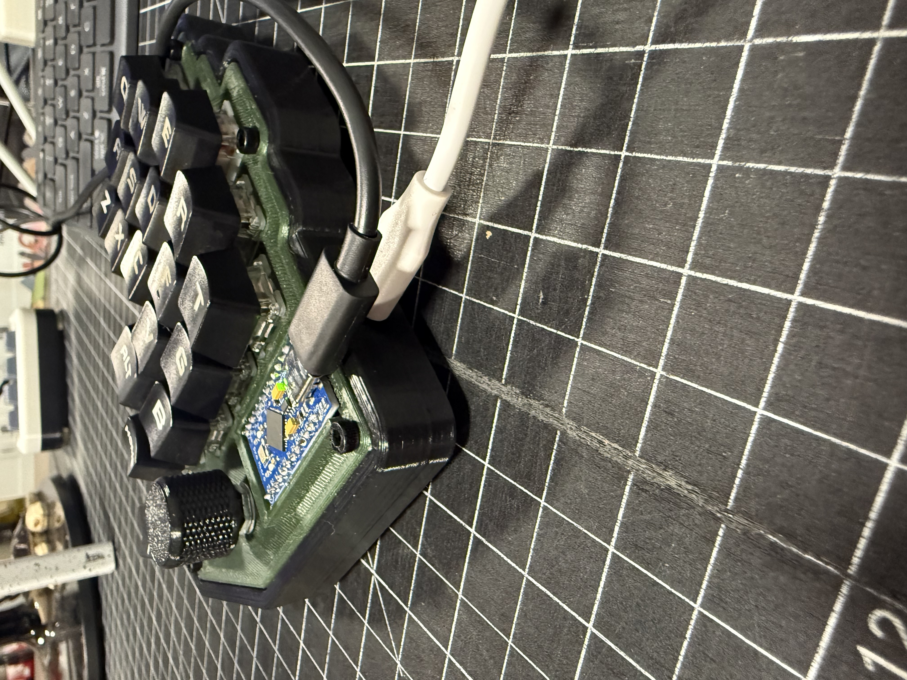

# bum_36

A compact hand-wired split keyboard with 36 keys, dual rotary encoders, 3D-printed plates/cases, and QMK/Vial firmware support.



## Overview

The `bum_36` is a small split ergonomic keyboard built around a hand-wired matrix and Pro Micro-compatible controllers. This project directory includes the printable case files, build photos, and firmware needed to reproduce or customize the board.

## Gallery

| Top View | Front View |
| --- | --- |
|  |  |

| Wiring | Connection Detail |
| --- | --- |
|  |  |

## Project Files

### STL files

- `stl_files/left_plate_v1.1.stl`
- `stl_files/left_plate_v1.2.stl`
- `stl_files/right_plate_v1.2.stl`
- `stl_files/right_case_v1.1.stl`

### Firmware

- `firmware/` - local copy of the keyboard firmware files
- `firmware/keymaps/vial/` - Vial-enabled keymap
- `bum_36_vial.hex` - prebuilt firmware image for flashing

If you are integrating this into a QMK tree, the matching keyboard files are also available under `qmk_firmware/keyboards/bum_36/`.

## Keyboard Specs

- Layout: 36-key split layout
- Construction: hand-wired
- Firmware: QMK with Vial keymap included
- Controllers: Pro Micro-compatible
- Rotary encoders: 2
- Split communication: I2C

## Materials

This build used the actual parts and wiring for the bum_36 split keyboard.

### Core electronics

- Controllers: 2 Arduino Pro Micros
- Switches: 36 Cherry MX Brown switches
- Diodes: 1N4148 diodes
- Rotary encoders: 2 standard CY1111/EC11-style encoders
- Split communication: 4-pin USB-C breakout boards used to pass I2C between halves

### Printed parts

- Plate material: 3D-printed plastic
- Case material: 3D-printed plastic
- Print profile: standard hobby printer settings with enough strength for the plates and case
- STL version used: the included `stl_files/` versions in this folder

### Hardware and consumables

- Matrix wiring: solid copper wire for rows and columns
- Board wiring: stranded wire for the connections to the Pro Micros and other components
- Solder: 70/30 solder
- Heat shrink: clear shrink tubing for insulation
- USB: USB-C cable and a 4-pin USB-C breakout for I2C communication
- Keycaps: standard keycaps and rotary encoder knobs
## Build Notes

### Design summary

This board uses a compact split layout with thumb keys and one encoder per half. The included files suggest a hand-wired build paired with 3D-printed structural parts.

### Assembly summary

1. Print the selected plate and case files.
2. Install switches and encoders into the printed parts.
3. Hand-wire the switch matrix and diodes.
4. Wire each half to its controller.
5. Connect the two halves using the chosen split communication hardware.
6. Flash the firmware and verify matrix, layers, and encoder behavior.

### Personal build notes

- Case/plate files used: `[enter files used]`
- Wiring notes: `[enter notes]`
- Encoder orientation notes: `[enter notes]`
- Issues encountered: `[enter notes]`
- Revisions for next build: `[enter notes]`

## Firmware

The repository includes firmware sources and a precompiled Vial `.hex` file.

### Default layer behavior

- Base layer: alphas and primary typing layout
- Lower layer: numbers and navigation
- Raise layer: symbols and function keys
- Adjust layer: boot/reset and media controls

### Encoder behavior

- Base: mouse wheel on one encoder, volume on the other
- Lower: horizontal navigation and media track control
- Raise: arrow-style movement and display brightness
- Adjust: navigation and volume control

### QMK build example

```sh
make bum_36:default
```

### Flash example

```sh
make bum_36:default:flash
```

For QMK setup instructions, see the official documentation: <https://docs.qmk.fm/>.

## Repository Structure

```text
split_keebs/bum_36/
├── images/
├── stl_files/
├── firmware/
├── bum_36_vial.hex
└── readme.md
```

## To Do

- Add the final bill of materials
- Add wiring diagram(s)
- Add print settings and tolerances
- Add keymap screenshots or layout diagrams
- Add flashing notes for first-time builders
